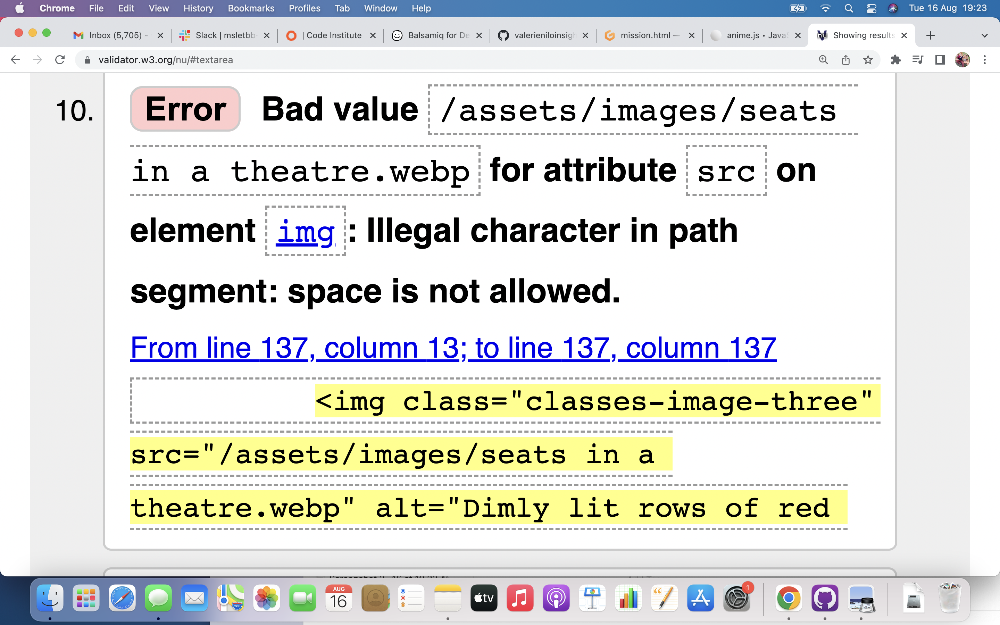

<h1>PURE DRAMA FOR TWEENS AND TEENS</h1>

<h2><em>Provisional Introduction</em><h2>

<h3><b>-What the project hopes to accomplish.</b></h3>
 
The aim of the website is to advertise newly launched, performance-based classes for tweens and teens in Clonakilty. The website is in association with 'Pure Drama Limited', a newly establised company founded by facilitator/practitioner, Joanne Downey and her husband, Michael Downey. Having graduated with an Honors degree in 'Drama and Theatre Studies' and an MFA in Playwriting, Joanne has launched her own company 'Pure Drama' with her husband, Michael Downey and the pair are launching classes in their native town of Clonakilty. The website should successfully display what is on offer with the classes (content/format), describe who the facilitator/teacher is as well outline the mission of the newly established company and describe what their relevant experience/qualifications are. The site should also indicate towards the format of the end-of-term shows and highlight how the cast/crew will be sourced from the classes but that it is not mandatory for the people in the class to participate in the show. The content and location of the classes should be presented. With the design, it should be concisely outlined how the classes can be offered one-on-one or in groups, what times are available and what will be involved with the classes. There will be an interactive, responsive page also which allows the user of the website to input their details and preferences.

<h3><b>Who the project is targetting.</b></h3>

The project is targetting the parents of tweens and teens, as well as the tweens and teens in the locality (as well as those willing to commute), who are looking to make better use of their spare time or to experiment with different styles of performance (sketch-writing, stand-up comedy, improvisation, monologue, duologue, hosting etc.) The classes are suitable for those who wish to perform in the end-of-term show, which will be open for the attendance of the general public but will be equally suitable to those who do not wish to perform at all and who simply want to attend on a casual basis/to gain confidence in their own lives and this should be conveyed in the website. Potentially, the classes could offer an alternative to locals who do not have an interest in the vibrant sports scene in Clonakilty and wish to have a different social outlet, so it should be evident in the website that a casual approach to the classes will be accepted.
 As this will be the inaugural year of the project, and with the precarious nature of Irish Arts funding (particularly in rural Ireland), it will be important to outline the support via sponsorship of local businesses, as well as the support of the local council who will be providing the rehearsal/performance space.

<h3><b>How it will be useful to a target audience.</b></h3>

The website will be useful in conveying the potential outcomes/results and rewards of joining the classes (with a description of the show and the social/community aspect) and what is possible to people of the town. The <em>Welcome Page</em>, has some key information about the target group, the location of the classes and the times and content of the classes. It describes the suggested format of the classes, which is adaptable. There is a navigation section that leads to two other tabs (the <em>Our Mission Page</em>and the <em>Sign-Up Page</em>). This navigation section will consistently appear on all three pages as it is good user design.

The <em>Our Mission Page</em> will be very clear and descriptive about what the ethos of 'Pure Drama Limtied' is and what they aspire to achieve. It will also detail the background, experience and qualifications of the lead facilitator, Joanne Downey. This will be very informative to the target audience and the aim of this is to provide them with confidence in the classes, so that they trust the quality and join. Additionally the <em>Our Mission</em> page will offer a more general explanation for the content of the five class types, with modern-day celebrities/shows referenced so that the target audience can form an idea of what the overall goal of the classes is.

The third tab, the <em>Sign-Up Page</em>, will allow the user to input their details and to declare their preferences in terms of the format (individual/group) and type of class that they are interested in. This information will feed into a database and be very useful to Joanne in terms of what she should offer. Information that will be gathered includes name, email, format of class and type of class. Radio buttons and checkboxes will be used for this effect as well. An omnipresent loading animation has been inserted that has been adjusted to fit in with the color scheme of the website.  Though nothing is loading, the idea with this being present is that it will inspire people to be active in filling out the form and to promote action. There is also a feedback box included so direct requests can be communciated to Pure Drama.

<h2><b>FEATURES:</b></h2>

There are a number of existing features included in the website that enhance the user experience. We also have ideas for innovative future features to add once the classes have started that will improve the overall user experience. Please see a list of the features below, as well as how they responded to testing.

<h3><b>EXISTING FEATURES</b></h3>

<h4>1. Welcome Landing Page:</h4>
<ol>
<li>
<h5><b>Feature: Pure Drama title animation</b></h5>
The value the feature provides: The keyframe animation that has been added to the 'Pure Drama' title highlights the importance of the title relative to the rest of the page
what it aims to achieve: Sets the title apart and introduces 'Pure Drama' as the name, whilst also asserting an ambiance of fun and creativity
Response to testing: As intended, the 'tada' animation automatically plays once the page is opened. It doesn't just play once, it plays each time the 'Welcome Page' is reopened and continues for the expected duration of five seconds.
</li>
<li>
<h5><b>Feature: Navigation Bar</b></h5>
The value the feature provides: Enables the user to navigate from page to page easily.
What it aims to achieve: This feature will reduce the level of scrolling and divide the website into three different tabs.This is featured on all three tabs for consistency and also to ensure that the user can easily navigate from tab to tab without reverting back to the previous page. The fully responsive navigation bar includes links to the Landing Page denoted as "Welcome", the mission page denoted as "Our Mission" and the sign-up page, denoted as "Sign-Up". 
Response testing: As intended, once hovered over, each of the navigational links becomes highlighted in white and once a page is clicked, it correctly bring us to the selected page.
</li>
<li>
<h5><b>Feature: Muted video of applause that autoplays when scrolled over</b></h5>
The value the feature provides: Makes the page more animated, highlights the performance/audience element of the classes, adds to the welcoming atmosphere of the page and creates a sense of energy. 
What it aims to achieve: The user does not have to do anything aside from scroll over the video for it to play automatically. It is also muted to avoid disruption as the audio of the video might be uncomfrtable/unwanted for the user if they are in the library or a quiet area for example or listening to music. it aims to create a welcoming and energetic effect.
Response to testing: The video correctly autoplays once the screen scrolls onto it. It pauses and recommences playing if scrolled over and back until the ten seconds plays out in full. As intended, it does not play on loop but stops playing after ten seconds. As intended, if the user navigates to a separate tab and back onto the welcome page, the video resets and plays automatically again from the start once scrolled over. As intended, it is muted and plays in silence to avoid disruption.
</li>
<li>
<h5><b>Feature: Iframe map of Clonakilty</b></h5>
The value the feature provides: Provides the user with an idea of where the classes are located
What it aims to achieve: Creates a visual of the location of the classes, so even if the user is not familiar with the town, they can get a general idea of whether the classes are within a commutable distance of their location
Response to testing: As intended, a large map of the relevant town of Clonakilty is displayed on the page, without any interaction required from the user, taking up 100% of the width of the page. The map is highly functional and interactive. Different areas of the twon can be selected and information is displayed about the address, directions and various online reviews. The zoom in/out function is fully functional and if the user desires directons to a certain place, the directions button can be selected and this opens on a separate page in Google maps with the address of the selecetd location automatically input.
</li>
<li>
<h5><b>Feature: Social links that include hyperlinks to the social media that open in a separate tab</b></h5>
The value the feature provides: Though these are generic links currently, the idea is that the personalised facebook, instagram, youtube and twitter pages related to the 'Pure Drama' company will open in separate tabs once these links are selected. This will cause a strong link between the website and all alternative forms of online presence. The facebook, instagram, twitter and youtube will showcase the amount of public support, with the youtube page showing viewcount, subscribers and comments on videos. The youtube page will be fully dedicated to long-form videos and demonstrations and will have a number of introductions to classes presented by Joanne Downey. The twitter account also will be linked, with daily status updates, interactions with other twitter users and an ability to see the twitter followers/what twitter user the page follows. Also, the facebook and instagram will be linked, with daily updates to photos, public comments of support and instagram follower and facebook followers/friends connected to the website.
What it aims to achieve: Interconnects all online platforms. Creates momentum, as if there is a strong presence or following on one platform, it is likely to positively affect the other platforms/inspire people to join the classes/grow people's confidence in the quality of the programme. It also increases the feeling of accessibility as 'Pure Drama' can be communicated with on any of these platforms. It increases the target audience exponentially as the scope of these platforms considered together is extremely expansive. There will be global appeal and may lead to offering online classes in future.
Response to testing: As intended, once the icon is selected, the relevant and correct webpage is opened in a separate tab
</li>
</ol>
<h4>2. Our Mission Page</h4>
<ol>
<li>
<h5><b>Feature: Navigation tab</b></h5>
The value the feature provides: Contains the same functionality as discussed on the 'Welcome-Landing' page
What it aims to achieve: Makes the website easy to navigate and lends a consistency to each of the separate pages on the website
Response to testing: As per <em>Welcome Page</em>, this is fully functional with the hover effect fully and navigating to the selected page features operating as intended.
</li>
<li>
<h5><b>Feature: Social Links</b></h5>
The value the feature provides: Creates the same effect as discussed on Welcome landing page
What it aims to achieve: Lends a consistency to each of the separate pages on the website and creates a link between all online platforms
Response to testing: As per the <em>Welcome Page</em>, the links are fully functional, opening in a separate tab onto the specified webpage, as intended.
</li>
<li>Feature: Animation on Joanne Downey's photograph. Using keyframes and the 'rubberBand' animation from 'Animate.css', I added an eye-catching animation to Joanne Downey's photograph that causes the image to stretech and retract like a rubberband for a period of five seconds
The value the feature provides: It draws the user's attention to Joanne, who has an integral role in the success of 'Pure Drama'. As the founder and key facilitator, the success of the company relies on the reliability, quality of work and skillset of Joanne so the section detailing her experience and qualifications is particularly important
What it aims to achieve: As this page is the most informative sections, with this particualr section laden in information, the animation provides light relief and is aesthetically engaging. It also draws attention to Joanne Downey
Response to testing: As intended, once Joanne Downey's image is scrolled over, the rubberBand animation automatically enacts for the specified duration of five seconds. As intended, this plays once per visit to the <em>Our Mission</em> page but will reset and replay once the tab is reopened.
</li>
<h5><b>3. Sign-Up Page</b></h5>
<ol>
<li>
Feature: Loading spinner
The value the feature provides: Though this animation is usually used to signify loading, I added a webkit spinner animation as an omnipresent feature on the Sign-Up page that is not connected with loading but supposed to provoke a feeling of momentum. I have increased the sizes of the individual dots and updated the color to match the design of the page also for design consistency
What it aims to achieve: I did this, as I want it to create a sense of momentum and provoke action from the user of the website, who is supposed to be inspired to fill out the 'Sign-Up' form and submit feedback
Response to testing: As intended, the spinner automatically plays once the page is opened and has an infinite duration. The design elements of the dots fit in with the rest of the content on the page as intended.
</li>
<li>
Feature: Responsive picture that changes based on the browser.
The value the feature provided: One image is presented on viewports with max-widths of 699px (e.g. an iphone), a different photo is shown on viewports over 700px (e.g. a laptop). If there is any issue with the brower, a separate image is also included as an alternative, this is the happy group image which is shown on the <em>Welcome Page</em>.
What it aims to achieve: Present alternative photos that are more suited to different viewports (iphone versus laptop) and also offer an alternative image if there is any issue opening these pictures
Response to testing: As intended, different images display once the viewport is decreased/increased over the 700px threshold.
</li>
<li>
Feature: Field-sets to enter contact details
The value the feature provided: Ability for the user to submit important personal information quickly and safely to the website facilitator
What it aims to achieve: Present an interactive and clearly laid out section where the user can input their name and email address. There fields also change pink when the user clicks on them.
Response to testing: As intended, once a field is selected it becomes highlighted in pink, signifying that it is active. Text can be input freely into each of the boxes and the submit button functions fully. Once submit is selected, a separate page is opened, confirming the information that has been submitted.
</li>
<li>
Feature: Radio buttons for the type of class the user wants to participate in
The value the feature provided: This will give the website facilitator vital information about the demand of the classes by type
What it aims to achieve: The user can only select one of the three options 'Individual', 'Group' or 'Both' so that they don't accidentally sign up for group classes if they solely want individual classes or vice versa. It is also a 'required' feature, so the submit button will not function if an option is not selected
Response to testing: As intended, it is not possible to select more than one of the three radio buttons at a time and selecting one is a required feature, the website will not allow you to submit this section without selecting an option. As intended, if the user attempts to submit the section without selecting one of the three options, a message apears, prompting them to select an option before submitting, saying "Please select one of these options"
</li>
<li>
Feature: Checkboxes for the style of classes that the user wants to participate in
The value the feature provides: This will provide vital information to the website facilitator about the demand for classes and what classes are popular
What it aims to achieve: The user can select as many styles of classes as they like and the information will be provided to the website facilitator
Response to testing: As intended, the user can tick all of the boxes if they so choose. The submit button works accordingly but only one of the classes selected is listed on the separate confirmation of form submission page. In the design of the real website, as many classes as selected will appear on the confirmation of submission page
</li>
<li>
Feature: A feedback box
The value the feature provides: A box where the user can type in any requests that they have or any feedback that they have for the website facilitator. The smaller size of the box is supposed to indicate tha the nature of the feedback at this point is supposed to be concise as the classes have not started yet.
What it aims to achieve: Provide a voice to potential students who would like to request something that is absent on the website/not offered. This feedback will go directly to the facilitator and is not anonymous so can be responded to also. The box becomes highlighted in pink when words are being input, to avoid the user accidentally typing into it and submitting when not intended 
Response to testing: As intended the box is highlighted in pink once selected. As intended, the box can be dragged to expand by selecting the little triangle in the bottom right of the box and dragging it out. If more words are typed into the box than fit the small window, a scrollbar will appear allowing the user to continue typing and scrolling the box down. As intended once the 'Break a leg!' submit button is selected, a separate tab opens confirming submission and outlining the feedback data that has been input.
</li>
<li>
Feature: Collapsible contact details widget
The value the feature provides: An interactive widget feature wherein the user of the website can click on the dropdown 'Contact Pure Drama'summary to reveal the contact information, if they want to
What it aims to achieve: A stylish and comfortable feature that requires action prior to revealing the contact details and that will hide automatically once the page reloads. This will also create a sense of confidence that only people who are interested in the classes/have read through the website will contact the facilitators as opposed to someone who is not serious and just wants to prank email the facilitators. It is also made half as opaque opaque than the rest of the page to signifiy the private, sensitive nature of the contact details
Response to testing: As intended, the collapsible widgets expands to reveal the contact details once the triangle is clicked on. The information appears in an aligned format as planned, this is due to adding the table formatting in the code.
</li>
</ol>

<h3><b>FEATURES LEFT TO IMPLEMENT (Future Features)</b></h3>

 

 <ol>
 <li>The intention is to work with a videographer who, with express permission, will record and edit the launch, segments of the classes and the end-of-term performance and a well-edited show reel summary will play on the landing page once available</li>
 <li>There will be an additional audio feature added wherein vox-pop recordings of student testimonials can be played by the user of the website in the 'Student Feedback Dection'. It will be well laid out, revealing the name and age of the students and the testimonials will be divided out by style of class (e.g. drama, comedy, improv etc.). The voiceovers of the testimonials from students will not play automatically once the website is opened, as that may be disruptive and not user-friendly but can be played once the user selects to do so. This will be an interactive feature.</li>
 <li>Once the classes start and the facilitator meets the students and grows to understand their preferences/abilities and needs, the sign-up page will be expanded to garner more information from prospective students (e.g. maybe monologue preferences).</li>
 <li> In the feedback section, weekly polls will be added to get direct feedback from the students in relaiton to the classes.</li>
 <li>A well-styled, responsive gallery page will be added, displaying still images taken from launches, classes and performances. This images will be date stamped and credited accordingly</li>
 <li>As the classes progress, the students will have an integral role with the content available in the online presence and the various platforms. There are other social media outlets that may be more appealing to the target audience/demographic that may be added depending on the feedback of the students. These outlets include (but are not limited to) tiktok</li>
 </ol>
 

 <h2>TESTING</h2>

 I have conducted enough testing to legitimately believe that the site works well, as outlined in the various types of testing below: Manual testing, Lighthouse testing using developer tools, viewing the website on different browsers both manually and online and validator testing using online validation websites W3C and Jigsaw. 
 
  Also, as noted in the features section above, I have also manually tested all of the project's features and ensured that they operated as intended, outlining the response in each of the features sections.

 I tested the website in a variety of ways to ensure full functionality. This included manual testing (e.g. testing each feature and ensuring that it could complete what it was in place to complete) Additionally, I interacted with developer tools and the lighthouse function to see the code/make updates and to test different viewports. I manually checked the viewports on my phone and laptop also to ensure that the website was fully responsive, as intended. I also tested the website on different viewports online.

   I used different tools to perform the validation testing on the code, as outlined below. I used W3C to est HTML and W3C Jigsaw to test CSS.

 <h3>Manual Testing of the responsiveness of the website:</h3>
 1. To different viewports
  I opened the website on my phone and the responsive elements worked accordingly-viewport height, viewport weight and different photos used on differed sizes:

  Responsiveness testing:
  Using developer tools, Jigsaw screenshot:
                            Iphone 11  Macbookpro  Notes
  Site is responsive>=700px   n/a      Good         
  Site is responsive<=700px.  Good     n/a.   When does screen get too small
  Links/URLs:                 Good     Good
  Images work:                Good     Good

 Viewports tested online:
 What type of viewports, make a list

 2. To different browsers

 I opened the website on my laptop and it worked accordingly

 Browsers: Safari, Google Chrome, Internet Explorer, Firefox

  Browser compatibility:
                               Chrome       Firefox         Safari         IE        Notes:
  Intended appearance:         Yes          Yes              Yes           Yes
  Intended responsiveness:     Yes          Yes              Yes           Yes       

VALIDATOR TESTING:
Interesting bugs and problems discovered whilst testing:

  <h3>Addressed bugs and problems:</h3>
  <li>
  Sign-Up Page: Initially I thought one button could be used to submit all selected answers but it only worked to subnmit the feedback so I separate the sections into different forms.
  </li> 
  <li>
  Please see a list of the HTML errors below, with my response to the issues included.
  </li>
  <h3>Unaddressed bugs and problems"</h3>
  <li>
  Sign-Up Page: One unaddressed issue that I was unsure about how to resolve is that for the checkboxes class style section, it is the intention that the user can select as many classtypes as thet want. However, once the submission page is opened upon submission, only one answer is revealed.
  </li>

Bugs:

1. What was the problem?: The sections of the sign-up page only had one submit button for all sections and only one option was allowed to be selected for the radio-button and checkboxes sections combined.
What was the solution?: I divided these out by section and created individual forms for each section to enable them to oeprate separately

2. What was the problem?: The photos in the classes section were not aligning
What was the solution?: I applied relative sizing and inserted left-margin code

3. What was the problem?: Aligning the information in the collapsible widget, the words were scattered and looked messy
What was the solution?: I inserted a table and updated the alignment

4. What was the problem?: The images would not load
What was the solution?: The names of the filepaths contained spaces and had to be updated to contain underscores '_' between words

<h2>LIGHTHOUSE</h2>
I accessed the 'LIGHTHOUSE' trsting tool via Developer Tools. Please see a screengrab of the successful lIGHTHOUSE testing below. I believe all %s are adequate:

Please see details on the manual testing of all of the website (HTML first, followed by CSS)

<h3>The testing of <b>HTML</b> was completed on the W3C Validator.</h3>

In order to test each page, I copied the HTML code directly from GITHUB and pasted it into the direct input window on the validator, per the below:

Per the screengrabs included, I manually pasted in the HTML of each individual page and amended each of the errors as I progressed. Please see the results for each page below (divided out by error), including my responses to each issue:

<h2><b>HTML:</b></h2>
  <h3>1. Welcome Landing page errors:</h3>
  <ol>
  <li> 
  
The first error in the HTML code on the Welcome page was as follows:

  
Screengrab of error:

  
Description of error: The word 'contant' in meta data is not an attribute that is allowed

  
Response to error: Updated typo of 'contant' to 'content'

  </li>
  <li>
  
The second error in the HTML code on the Welcome page was as follows:

  
Screengrab of error:

  
Description of error: Element does not contain 'content'

  
Response to error: Updated type 'contant' to 'content'

  </li>
  <li>

The third error in the HTML code on the Welcome page was as follows:

Screengrab of error:

  
Description of error: Unneeded ending tag of 'meta' included

  
Response to error: Deleted extra meta tag

  </li>
  <li>
  
The forth error in the HTML code on the Welcome page was as follows:

  
Screengrab of error:

  
Description of error:
 Aria-label added to cover image id, possible misuse of aria-label
  
Response to error: As it is visible text that labels an element, updated to 'aria-labelled by' instead

  </li>
  <li>
  
The fifth error in the HTML code on the Welcome page was as follows:

  
Screengrab of error:

  
Description of error: First section lacks header

  
Response to error: Updated Pure Drama title to h2 header

  </li>
  <li>
   
The sixth error in the HTML code on the Welcome page was as follows:

   
Screengrab of error:

  
Description of error: No p element in scope but a closing tag for p included

  
Response to error: Moved closing tag for p above hr where it is supposed to be

  </li>
  <li>
  
The seventh error in the HTML code on the Welcome page was as follows:

  
Screengrab of error:

  
Description of error: No heading included in introduction section, change section to div or else add heading

  
Response to error:Added a h2 heading of 'What's On?' to the section.

  </li>
  <li>
  
The eight error in the HTML code on the Welcome page was as follows:

  
Screengrab of error:

  
Description of error:No heading included in location section, change section to div or add h2-h6 heading

  
Response to error: Added h4 heading of 'But, where?'

  </li>
  <li>
  
The ninth error in the HTML code on the Welcome page was as follows:

  
Screengrab of error:

  
Description of error: Iframe width is not acceptable in a % format

  
Response to error: Delete % but applied flexbox instead to retain responsive nature of the map to different viewports. Researched and extracted coding from 'stackoverflow.com', having learned about flex from Slack threads. Inserted general flex code in CSS to be applied to various images where needed throughout website

  </li>
  <li>
  
The tenth error in the HTML code on the Welcome page was as follows:

  
Screengrab of error:

  
>Description of error: The frameborder attibute in iframe code is obsolete.

  
Response to error: Deleted this attribute entirely as applied flex instead

  </li>
  <li>
  
The eleventh error in the HTML code on the Welcome page was as follows:

  
Screengrab of error:

  
Description of error: The scrolling attribute in iframe code is obsolete.

  
Response to error: Deleted this attribute entirely as applied flex instead

  </li>
  <li>
  
The twelfth error in the HTML code on the Welcome page was as follows:

  
Screengrab of error:

  
Description of error: The marginheight attribute in iframe code is obsolete.

   
Response to error: Deleted this attribute entirely as applied flex instead

  </li>
  <li>
  
The thirteenth error in the HTML code on the Welcome page was as follows:

  
Screengrab of error:

  
Description of error: The marginwidth attribute in iframe code is obsolete.

  
Response to error: Deleted this attribute entirely as applied flex instead

  </li>
  <li>
  
The forteenth error in the HTML code on the Welcome page was as follows:

  
Screengrab of error:

  
Description of error: Text not allowed in iframe in this context

  
Response to error: Deleted accordingly, had been deleted when updated to flex coding

  </li>
  <li>
  
The fifteenth error in the HTML code on the Welcome page was as follows:

  
Screengrab of error:

  
Description of error: Text not allowed in iframe in this context

  
Response to error:As per error 14, deleted accordingly, had been deleted when updated to flex coding

  </li>
  <li>
  
The sixteenth error in the HTML code on the Welcome page was as follows:

  
Screengrab of error:

  
Description of error: Text not allowed in iframe in this context

  
Response to error: As per error 14&15, deleted accordingly, had been deleted when updated to flex coding

  </li>
  <li>
  
The seventeenth error in the HTML code on the Welcome page was as follows:

  
Screengrab of error:

  
Description of error: Text not allowed in iframe in this context

  
Response to error:As per error 14,15&16, deleted accordingly, had been deleted when updated to flex coding

  </li>
  </ol>
  <h3>>2. Our Mission page errors:</h3>
  <ol>
  <li>
    
The first error in the HTML code on the Our Mission page was as follows:

    
Screengrab of error:

  
Description of error:

  
Response to error:

  </li>
  <li>
   
The second error in the HTML code on the Our Mission page was as follows:

    
Screengrab of error:

  
Description of error:

  
Response to error:

  </li>
  <li>
   
The third error in the HTML code on the Our Mission page was as follows:

    
Screengrab of error:

  
Description of error:

  
Response to error:

  </li>
  <li>
   The forth error in the HTML code on the Our Mission page was as follows:
Screengrab of error:

;

  Description of error:
  Response to error:
  </li>
  <li>
   The fifth error in the HTML code on the Our Mission page was as follows:
Screengrab of error:

;

  Description of error:
  Response to error:
  </li>
  <li>
   The sixth error in the HTML code on the Our Mission page was as follows:
Screengrab of error:

;

  Description of error:
  Response to error:
  </li>
  <li>
   The seventh error in the HTML code on the Our Mission page was as follows:
Screengrab of error:

;

  Description of error:
  Response to error:
  </li>
  <li>
   The eigth error in the HTML code on the Our Mission page was as follows:
Screengrab of error:

  Description of error:
  Response to error:
  </li>
  <li>
   The ninth error in the HTML code on the Our Mission page was as follows:
Screengrab of error:

  Description of error:
  Response to error:
  </li>
  <li>
   The tenth error in the HTML code on the Welcome page was as follows:
Screengrab of error:

  Description of error:
  Response to error:
  </li>
  <li>
   The eleventh error in the HTML code on the Welcome page was as follows:
Screengrab of error:

  Description of error:
  Response to error:
  </li>
  <li>
   The twelfth error in the HTML code on the Our Mission page was as follows:
Screengrab of error:

  Description of error:
  Response to error:
  </li>
  <li>
    The thirteenth error in the HTML code on the Our Mission page was as follows:
Screengrab of error:

  Description of error:
  Response to error:
  </li>
  </ol>
  <h3>3. Sign-Up page errors:</h3>
  <ol>
   <li>
    The first error in the HTML code on the Sign-Up page was as follows:
Screengrab of error:

  Description of error:
  Response to error:
   </li>
  <li>
   The second error in the HTML code on the Sign-Up page was as follows:
Screengrab of error:

  Description of error:
  Response to error:
  </li>
  <li>
   The third error in the HTML code on the Sign-Up page was as follows:
Screengrab of error:

  Description of error:
  Response to error:
  </li>
  <li>
   The forth error in the HTML code on the Sign-Up page was as follows:
Screengrab of error:

  Description of error:
  Response to error:
  </li>
  <li>
   The fifth error in the HTML code on the Sign-Up page was as follows:
Screengrab of error:

  Description of error:
  Response to error:
  </li>
  <li>
   The sixth error in the HTML code on the Sign-Up page was as follows:
Screengrab of error:

  Description of error:
  Response to error:
  </li>
  <li>
   The seventh error in the HTML code on the Sign-Up page was as follows:
Screengrab of error:

  Description of error:
  Response to error:
  </li>
  <li>
   The eigth error in the HTML code on the Sign-Up page was as follows:
Screengrab of error:

  Description of error:
  Response to error:
  </li>
  <li>
   The ninth error in the HTML code on the Sign-Up page was as follows:
Screengrab of error:

  Description of error:
  Response to error:
  </li>
  <li>
   The tenth error in the HTML code on the Sign-Up page was as follows:
Screengrab of error:

  Description of error:
  Response to error:
  </li>
  <li>
   The eleventh error in the HTML code on the Sign-Up page was as follows:
Screengrab of error:

  Description of error:
  Response to error:
  </li>
  </ol>
  
  <b>CSS:</b>

  <h3>The testing of CSS was completed on the JIGSAW Validator.</h3>

 Please see the W3C igsaw validator below:

  1. Welcome Landing page
  2. Our Mission page
  3. SignUp page
 
  <b>UNFIXED BUGS</b>
   
   Mention unfixed bugs and why they were not fixed. Include shortcomings of the frameworks and technologies used. 

   Difficulty with responsiveness (Flex-box vs CSS grid)
   Layout and positioning
   The applause video on the welcome page still contains the adobe mark on video
   

   <b>DEPLOYMENT PROCESS</b>

   The site was deployed to GitHub pages. I took the following steps to deploy the site:
<ol>
   <li>In the relevant GitHub repositary, I navigated to the Settings tab.</li>
   <li>From the source section drop-down menu, I selected the Master Branch.</li>
   <li>Once the Master branch was selected, the page automatically refreshed with a detailed ribbon display to indicate the successful deployment.</li>
</ol>
   As then specified on GITHUB, the <em>live link</em> can be found here:

   <b>CREDITS:</b>

   As seen on the website, I drew inspiration from many different sources. i was inspired by the 'Love Running website' in the formatting of some of my features and used many different sources referenced in the tutorials for the images and content. Please see credits below for content and images/videos.:

   <b>CONTENT:</b>

   -Text for homepage was taken from ''
   -Icons beside the text throughout the website and in the footer were taken from Font Awesome

   <b>MEDIA:</b>
   1. Welcome-Landing Page
   The background-image used in the 'Welcome' page is from:
   The photo divided out into class times is taken from ''
   'The video of applause' that autoplays when scrolling down the 'Welcome' page is taken from
   The iframe that showcases the location of the town is taken from ''

   2. Our Mission Page
   The 'road ahead' picture was taken from ''
   The Joanne Downey photo was taken from ''
   The five photos in the classes section was taken from the following, respective places: ""
   Group of Silhoutettes in the Sun:
   Commedia dell'arte mask with rose:
   Illuminated rows of red seats at the theatre:
   Clapper, cinema tickets and popcorn:
   Hand procuring a microphone in a circle of light:

   The icons beside the class descriptions came from font awesome

   3. Sign-Up Form
   The loading spinner animation was extracted from:
   The phots came from the following respective sources:
   600px photo of ''
   1000px photo of ''
   Image alternative photo of ''
   The icones beside titles, radiobuttons and checkboxes came from font awesome 

   The idea for the collapsible summary widget came from '

 -Common practice to use code from other repositaries and tutorials-important to be specific to avoid plagiarism
Code inspired by other repositaries and tutorials:

-Navigation tab-tutorial
-iframe for applause video, site offers option to copy code directly
-The format of the class slots is taken from the 'Love Running' tutorial
-The Social links footer is taken from the 'Love Running' tutorial
-The Sign-Up form section was inspired by Love-Running
-The collapsible widget was inspired by ''

User Experience:

Brainstorm: 

I brainstormed this idea by thinking about what type of website would be ideal for the goal that I have in mind: A minimum viable product that is well done and doesn't negate from the website due to lack of Javascript etc. I decided to go with a theme that I knew would work well from looking at the lectures (the first portfolio project/Love Running etc) As I am a Drama graduate who has taught a variety of performance-based classes at different venues, I felt that this would be suitable as my first project as I had the required expertise needed to disclose the information needed and knew that the theme was entertaining enough in itself.

I brainstormed the shape of the website by using Balsimiq which was made readily available to students of the Code institute. Please see screengrabs of Balsimiq below:

BALSIMIQ BRAINSTORM:

For this first project, which is heavily focussed on design, I wanted to create a solid minimum viable product as opposed to being overly ambitious and adding too much and making everything messy. I wanted to have clear features that were easy to navigate and fulfilled the function that they were there for. 

I beleive that the wEBsite is very user friendly, it is respeonsive and interactive, clearly laid out and accesible as it contains alts and aria-labels for screen readers.

I considered the five planes of user experience when designing my website: Strategy Plane, Scope Plane, Structure Plane, Skeleton Plane and the Surface pLANE.

Please see how I considered these below:

1. Strategy Plane: I needed to consider viability and usability as well as my limited resources and skillset considering this would be my first ever project. For it's purpose, the content is culturally appropriate and the content can be tracked in an intuitive way. The business goal of the website is to increase the awarness of the classes and to build a positive reportuation. Tech condi=sideration-website must appeal to tweens and teens and appeal ot their interest in facebook/twitter/youtube and instagram. The goal with the feedback form is to assist in the development of the website to make it more appealing to the user. It's a B2C website. Accordingly, I have made an affort to make the website catchy and appealing, with use of large images.

  In the research phases I decided this website would be worth doing as I would be informed.
What value can be provided to the demographic of tweens and teens and their parents
  
  
  Viability and Feasibility (have skills, resources, time to implement features) versus Importance (business goals and user needs). Deciding on what to keep and not to keep.

  List and rate opportunities 1-5 in terms of dimensions importance versus viability and feasability
  Broken into opportunities and problems to be solved

  -Create online presence
  -Make group known in the town and beyond
  -Showcase experience and qualifications
  -Detail sponsorships and present payment plan opportunity

  (sum of importance/average viability*number items
  )

  Competitive-offering wide variety of versatile classes, over several days with option to learn in groups or alone, feedback form and payment plans available-affordable.

2. Scope Plane:

What features of business/user needs needed
Agile approach-small bitesze increments of development
Minimal documentation-features simpl and schedule controllable

 new ideas for future features-suture releases

 sprint-duration of time committed to buidling something-rarely over one month

 If scope is too big, not meet deadlines, release date, commitment-was worried about that

 Avoid scope creep (adding random new features too late)
 Don't want scope too small-unimpressive products

 Requirements

 What users need
 What they actually need
 What they don't know they need

 Difference between imagining how something will be used and how it will actually be used

 Brainstorm-explore-discuss

 Requirement types

 Content requirements

 Mixed content used in our website-images, video

 Requirement categories-types: Useful, Sellable, Buildable

 Useful-yes website informs potential customrs
 Sellable-

 Objective-Functional-Non-functional-Business rules

 Objective-what does user want to accomplish
 Functional-What does user need to do to accomplish pbjective
 Non-functional-contraints website has. Scaleable:as user base grows, can application handle gorwth in traffic

 Business rules: What dynamic constraints do we have to meet?

 Product is a virtual representation of business

 User story-how user interacts with system

3. Structure Plane:

Organisation of functionality and content. Navigating through in a functional way.

Categories of information-sections

Info presentation and organisation-intuitive

Interaction Design

Structure and behavior of interactive systems

Meaning for rleationships elements-content, information

Functionality and interactivity

Reduces risk of user error,makes user aware of state chnages

-Site is consistent, predictable , learnable, visible and clear feedback (navigation bar and social links on every page)
-Interactive features consistent in colouring
-Scenario: Transitions, rollover, tool clips behave consistently
- Consistency of voice-lablels and terms. Content and imagery, stable and consistent style

Only different when enhances experience-e.g. pink submission buttons in 'Sign-Up' page

-Intuitive, single -trial learning, sitck to conventions

<b>Information Architecture</b>

Creation of organisational and navigational schemas

Principles of organisation

-Information Architecture -Visual vocabulary 

4. Skeleton Plane:

Naviagtion design and interface design

Design work-what form will application take
How will users get around how we present content

Give form to function
Establish value in users mind
Lead user toward continuing experience
Add value with each click
Add positivity to overall experience with each interaction

Only break from convetnion if you can improve on it

Suite of visual conventions

Give people what they need when they need it

Data at rest (database-MySQL, MongoDB) Data in motion (manipulated-python-Django) Data as presented (user interface)

Progressive disclosure-reveal information across space...navigation-different tabs used

Visuall group information in order of important- Mission-Education and Qualifications-Class content

E-Commerce site Hick-Hyman Law, too many options, the longer it takes for consumer to make a decision

Navigation-how do you find

browse, filters, search, pagination controls

progressive disclosure-progress bars

representational icons-font awesome 

colour, icons and text differentiate naviagtion elements

consistent-same across content 

Metaphors:

Useful in conveying info

visual metaphors

Good info design-invisible 

Easy to navigate, relevant information, good information design

too much information worse then no information 

context and order matter

hierarchy of importance

referential information-alphabetical

categorical when info is similar

clsutered, similar, category of information

Clean, minimal, effective

Wireframes

2D model of what finished product will be

Simplified, stripped down version of 

form, information, arrnagement

starting point

see balance of elements-sturcture-what gets included-how it's organised

Have i left anything out, priority content noticed first 

Wireframes allow us to revisit stratgey and goals

Wireframes-do relationships work, does it make sense (labels, arrangement and navigation)

5. Surface Plane:

A visual language that provides information and context

Provides colour, layout, fonts, images, order, sequence and the site's identity

Provides economy- important elements eaisly recognised 

Content-split

Progressive disclosure as move through naviational elements

Visual language-readability, legible, font contrast, consistent patterns

Color contrast between foreground and background

Contrast between fond...

Patterns consistent

